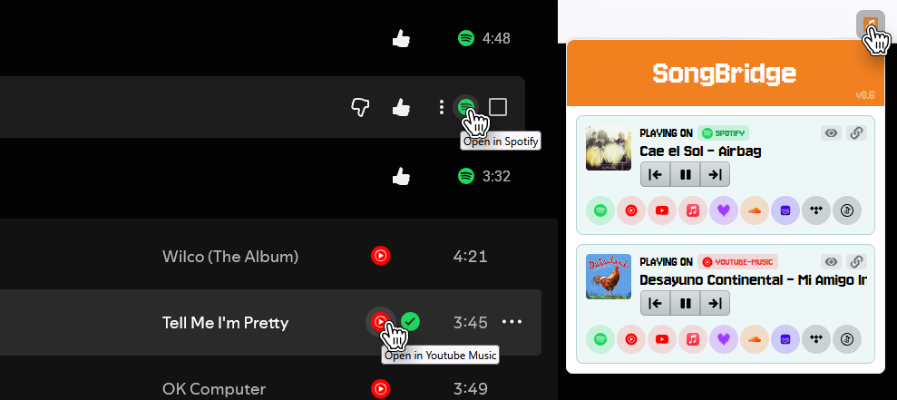

Adds utilities to music streaming web apps, currently Spotify and Youtube Music.

  
  

## Features

🎧 **Cross-platform shortcuts**  
Quickly open the same song on **YouTube Music ↔ Spotify** with one click.

🔗 **Smart music links**  
Instant access to the song on other streaming platforms while it’s playing.

⏯️ **Popup player controls**  
Control playback directly from the extension popup — no tab switching needed.

## API

It uses the Songlink/Odesli API to fetch cross-platform music links.  
It allows and usage of 10 requests per minute, which should be sufficient for most users.

## Changelog

[0.6] - Better styles, add player controls, allow multiple playing songs, add focus and copy link buttons, modified ytm algorithm  
[0.5] - Remove unused permissions, show version info  
[0.4] - Extension submit process fixes  
[0.3] - Extension submit process fixes  
[0.2] - Added currently playing popup  
[0.1] - Initial demo

## Screens

